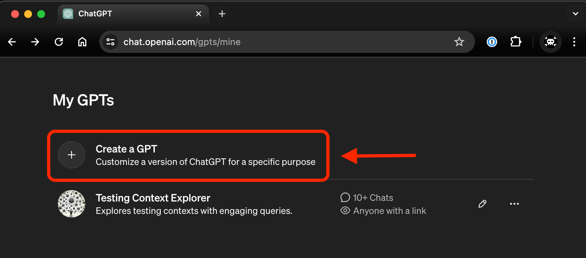
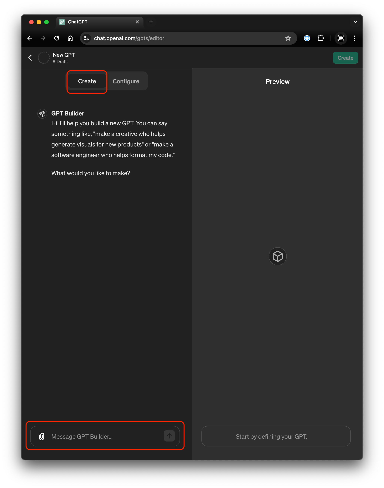
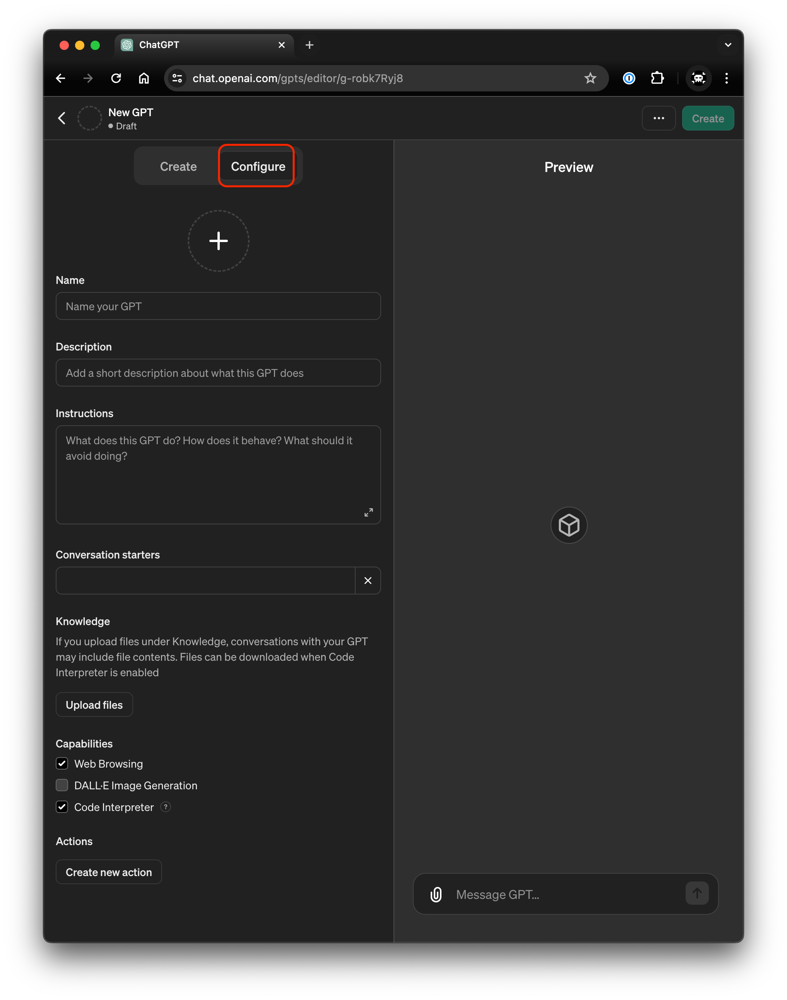
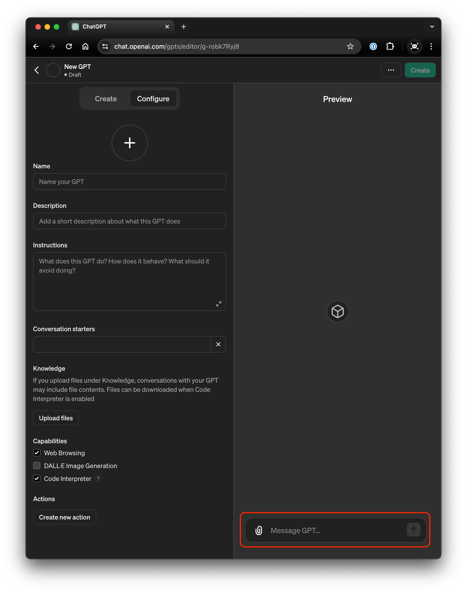
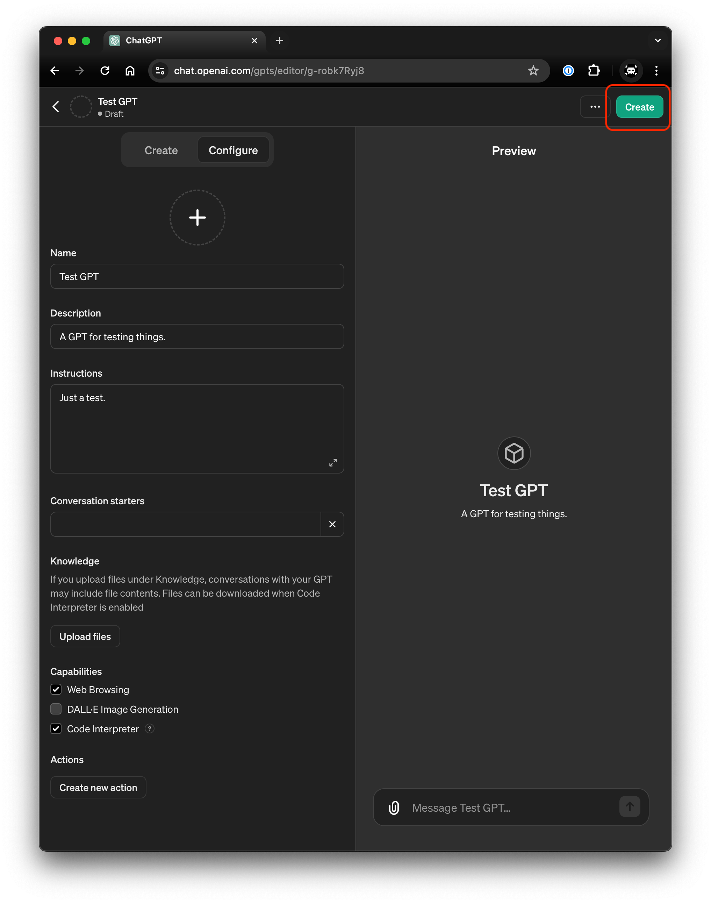
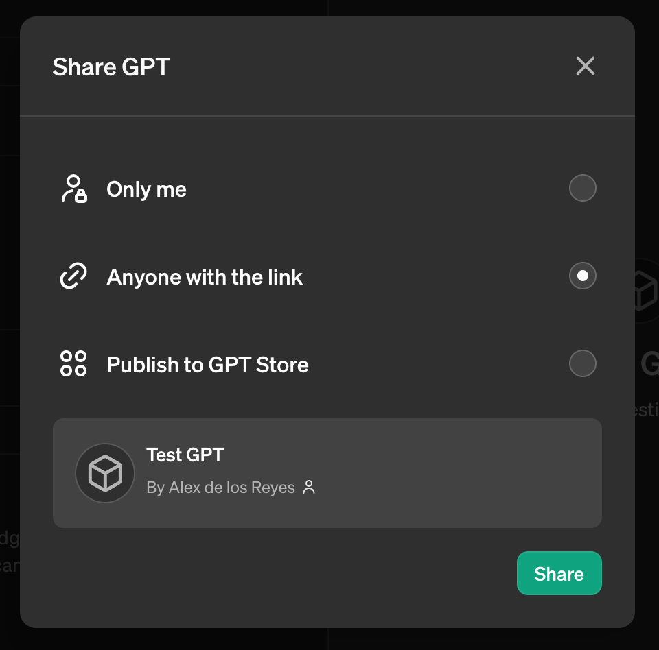

# Creating a Context-Driven GPT
## Introduction
The [Testing Context Explorer GPT](https://chat.openai.com/g/g-v48apj9qP-testing-context-explorer) is a sophisticated machine learning model utilizing OpenAI's GPT-4 technology, designed to enhance understanding and efficiency in software testing environments. This document aims to share the development process, offering insights useful to peers and innovators in the field on creating a GPT that was context-aware and utilized the main principles of Context Driven Testing and its related models of thinking.

## Concept Development
The inception of the Testing Context Explorer GPT was driven by three primary objectives, each aiming to bridge gaps between advanced technology and practical applications in software testing.

### Personal Skill Enhancement
The first motivation was educational. I sought to deepen my understanding AI/ML technologies by engaging directly in the creation of a GPT. This hands-on experience was intended to not only enhance my technical skills but also provide insight into the complexities and nuances involved in developing state-of-the-art AI models.  As a test engineer and skeptic, I wanted to build this tool to aid in my own exploration of the technology in order to evaluate its effectiveness in this domain.

### Advancing AI in Testing
Secondly, I aimed to push the boundaries of artificial intelligence within the realm of software testing. Traditional testing tools have been limited in their ability to adapt to new and evolving contexts without human intervention. By integrating GPT-4 into the testing process, the goal was to automate and enhance the intelligence of these systems, thereby increasing efficiency and effectiveness in helping humans to explore concepts in this domain and broaden the scope of thinking.

### Context-Driven AI
The third objective was to extend the context-driven approach prevalent in human decision-making to AI models. Most existing AI applications in testing operated with a narrow focus, often missing the broader context of the data they analyzed. By designing a GPT that could interpret and utilize wider contextual information, the project sought to create a model that mimics human-like understanding in interpreting test scenarios, making AI a more powerful and intuitive tool in software testing.

Through these goals, the Testing Context Explorer GPT was envisioned not just as a tool, but as a stepping-stone towards more sophisticated, context-aware AI systems in software testing. This endeavor not only promised to elevate my personal capabilities but also to advance the field of AI by addressing complex, real-world problems in innovative ways.

## Implementation
### Creating a Custom GPT with ChatGPT
The process of customizing a GPT model, particularly for a specialized application like the Testing Context Explorer GPT, involves several key steps. Here is a step-by-step guide of how to create a GPT with OpenAI's customized GPT creation tool.

1. Establish an account
    * Create an account through [OpenAI's ChatGPT](https://chat.openai.com/) user interface
    * To create and use your own customized GPT you must have a paid Plus or Team account subscription
2. Design the model
    * Gather data and plan for what will need to go in to the datasets used by your GPT
    * Have an idea of what you want from the GPT model and what sorts of things you expect from it
3. Build the model
    * From [My GPTs](https://chat.openai.com/gpts/mine) page click on Create a GPT
    
    * On the Create menu you can use a natural language interaction to create and instruct what the GPT should do in an interactive way.
    
    * From the interactive Create menu, you can provide instructions, do's, don'ts, should's, shouldn'ts, sources and materials for the GPT to use.
    * The Configure menu is an alternate way to enter these details and each section can be filled out manually and customized.
    
    * The Configure menu is automatically populated when the interactive creation is done.  This allows you to see what ChatGPT creates based on your inputs and configure as necessary and also enable and disable features of this GPT.
    * While building the GPT the right side of the screen has an interactive preview to try the GPT out and assess its behaviors for testing and evaluation
    
    * When ready, click Create in the upper right corner of the screen to create the GPT.
    
    * Select the level of sharing you want with this GPT.  This can be changed later.
    
4. Test, evaluate and iterate on the model
    * Work with the model to see how it behaves based on your instructions.
    * Provide it some manufactured examples of situations you would like to see it perform in to gauge the responses it provides.
    * Provide it some actual examples of situations you want it to perform in to guauge the responses it provided.
    * Iterate through configuration to change how it responds and behaves.
    * Add relevant data to the model and take out irrelevant data

## GPT Creation and Configuration
To create a robust dataset for training the Testing Context Explorer GPT, data was sourced from a variety of authoritative and context-rich materials that reflect current best practices and methodologies in software testing:

### Source: [Context-Driven Testing Principles](https://context-driven-testing.com/)
The principles outlined on the Context-Driven Testing website provided foundational content. This site is a well-known resource in the testing community for its detailed explanations of context-driven testing approaches, which prioritize the practical application of testing methods as dictated by the specifics of each project and environment.

### Source: [Modern Testing Principles](https://www.moderntesting.org/)
Information from the Modern Testing Principles website was also integral. This resource discusses more recent methodologies that focus on accelerating the achievement of shippable quality, thereby aligning closely with agile development environments and continuous delivery practices.

### Source: [The Testing Manifesto](https://www.growingagile.co/the-testing-manifesto/)
An image of the Testing Manifesto, which succinctly encapsulates key strategies and mindsets beneficial to testers in an agile framework, was included to train the model on modern testing philosophies and their practical implications.

### Source: [Heuristic Test Strategy Model](https://www.satisfice.com/download/heuristic-test-strategy-model)
A comprehensive Heuristic Test Strategy Model PDF provided detailed insights into a structured approach for planning test strategies. This document is instrumental for understanding various heuristics that can guide testers in creating effective test cases and strategies depending on the nature of the product and the testing context.

Each of these resources was selected in order to provide the model with relevant details to extract textual data in a format suitable for training the GPT.

### Providing the GPT with Instructions
To customize the Testing Context Explorer GPT for context-driven software testing, I used the interactive GPT creation tool, which allowed for precise model instruction and behavior configuration. Key sources like the Context-Driven Testing and Modern Testing Principles websites, along with the Testing Manifesto image and the Heuristic Test Strategy Model PDF, were integrated into the model's training data. This ensured the GPT was well-versed in relevant testing methodologies.

Further, I instructed the model to adopt a Socratic approach, prompting it to engage users with follow-up questions, enhancing dialogue depth. This method was aimed at encouraging users to think critically and explore testing concepts more thoroughly, improving the interactive experience and the utility of the GPT in practical scenarios.

## Testing and Optimization
Initial testing of the Testing Context Explorer GPT revealed that it was not engaging users with questions as consistently or effectively as intended. To address this, I utilized the interactive prompt configuration tool to refine the GPT's approach, emphasizing the need for it to consistently ask insightful questions. This adjustment aimed to ensure that every interaction would help users think more deeply about the testing context, fostering a richer, more analytical dialogue.

Beyond my personal evaluations, sharing the GPT with a broader audience became a crucial part of the testing process. While individual testing provided initial insights, it was somewhat limited in scope. By deploying the GPT in more varied, realistic scenarios and gathering feedback from diverse users, I could further evaluate its practical effectiveness and user engagement. This comprehensive testing approach helped identify any remaining inconsistencies in the model's interactive behavior, allowing for continuous refinement and improvement.
