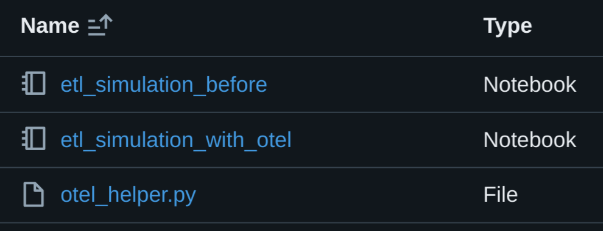

# ETL Simulation Guide

This guide explains the simulated ETL pipeline examples provided in this project, comparing the implementation with and without OpenTelemetry instrumentation.

## Overview

The project includes two example notebooks that demonstrate a simulated ETL (Extract, Transform, Load) pipeline:

1. `etl_simulation_before.py`: A basic ETL pipeline without OpenTelemetry instrumentation
2. `etl_simulation_with_otel.py`: The same ETL pipeline with comprehensive OpenTelemetry instrumentation


*Figure: File structure showing the example notebooks and helper file for ETL simulation*

These examples show how to add observability to your Databricks notebooks with minimal changes to your existing code.

## Notebook Cell Summaries

The instrumented notebook (`etl_simulation_with_otel.py`) contains the following key sections:

1. **Title & Introduction**  
   Introduces the notebook by describing its purpose: simulating an ETL pipeline with both trace and metric instrumentation using OpenTelemetry and Azure Monitor.

2. **Installation of Required Packages**  
   Provides pip commands to install the necessary libraries for OpenTelemetry and Azure Monitor (Application Insights) integration.
   ```python
   %pip install --upgrade azure-monitor-opentelemetry opentelemetry-sdk azure-core opentelemetry-api opentelemetry-sdk opentelemetry-instrumentation
   ```

3. **Restart Python Interpreter**  
   Issues commands to restart the Python environment to ensure that the newly installed packages are loaded.
   ```python
   %restart_python
   dbutils.library.restartPython()
   ```

4. **Import OpenTelemetryHelper**  
   Imports the helper class from the uploaded `otel_helper.py` file.
   ```python
   from otel_helper import OpenTelemetryHelper
   ```

5. **Initialize OpenTelemetry**  
   Sets up the OpenTelemetry helper with a parent span and metrics configuration.
   ```python
   etl_pipeline_id = str(uuid.uuid4())
   etl_otel_helper = OpenTelemetryHelper(
       span_name="ETL_Pipeline",
       etl_pipeline_id=etl_pipeline_id,
       span_metrics={
           "DataExtraction": {"records_extracted": "counter", "http_request_duration_sec": "histogram"},
           "DataTransformation": {"records_transformed": "counter", "transformation_duration_sec": "histogram"},
           "DataLoading": {"records_written": "counter", "write_duration_sec": "histogram"},
       },
       span_attributes={"data_source": "External API", "etl_type": "Full Load"}
   )
   ```

6. **Helper Functions**  
   Defines utility functions that simulate sleep time and random errors to mimic delays and failures during the ETL process.

7. **Data Extraction Stage**  
   - Starts a span for the extraction stage
   - Simulates an API call to extract data
   - Records extraction metrics and attributes
   - Handles potential errors
   - Ends the extraction span

8. **Data Transformation Stage**  
   - Starts a span for the transformation stage
   - Simulates data cleaning and transformation
   - Records transformation metrics and attributes
   - Handles potential errors
   - Ends the transformation span

9. **Data Loading Stage**  
   - Uses a decorated function for the loading stage
   - Simulates writing the transformed data to storage
   - Records loading metrics and attributes
   - Handles potential errors

10. **Finalization**  
    - Records overall ETL pipeline metrics
    - Sets final attributes on the parent span
    - Adds a completion event
    - Ends the parent span

## Comparing ETL With and Without OpenTelemetry

### Without OpenTelemetry (`etl_simulation_before.py`)

The non-instrumented ETL pipeline:

- Performs the same extraction, transformation, and loading operations
- Prints basic status information to the notebook output
- Lacks structured telemetry data for monitoring and analysis
- Provides no integration with monitoring systems
- Makes troubleshooting and performance analysis difficult

Example output from non-instrumented ETL:
```
--- PIPELINE-SPAN (parent): ETL Pipeline
    ETL_PIPELINE_ID:  1234-5678-90ab-cdef 
--- PIPELINE-SPAN (stage):  DataExtraction
    ...Sleeping for  2.5
    STATUS: records_extracted: 15000, http.status_code: 200, http.response_size: 750000 bytes
--- PIPELINE-SPAN (stage):  DataTransformation
    ...Sleeping for  1.8
    DataTransformation - records_input: 15000, records_transformed: 15000, records_failed: 0, transformation_duration_sec: 1.8, records_transformed_rate: 8333.33 records/sec, transformation_type: Data Cleaning, processing_engine: PySpark
--- PIPELINE-SPAN (stage):  DataLoading
    ...Sleeping for  3.2
    DataLoading - records_written: 15000, storage_path: /mnt/output/transformed_data, storage_type: Azure Data Lake, write_duration_sec: 3.2, records_write_rate: 4687.5 records/sec
--- ETL Pipeline COMPLETE
    ETL_Pipeline - ID: 1234-5678-90ab-cdef, Input Records: 15000, Output Records: 15000, Failed Records: 0, 
```

### With OpenTelemetry (`etl_simulation_with_otel.py`)

The instrumented ETL pipeline:

- Performs the same core operations as the non-instrumented version
- Creates structured spans for each ETL stage
- Records detailed metrics for performance analysis
- Captures error information and status codes
- Exports telemetry data to Azure Application Insights
- Enables comprehensive monitoring, alerting, and visualization

Example output from instrumented ETL (with additional OpenTelemetry logging):
```
--- PIPELINE-SPAN (parent): ETL Pipeline
    ETL_PIPELINE_ID:  1234-5678-90ab-cdef 
    OpenTelemetryHelper instance created for:  etl_otel_helper.etl_pipeline_id: 1234-5678-90ab-cdef
Starting DataExtraction span...
--- PIPELINE-SPAN (stage):  DataExtraction
    ...Sleeping for  2.5
    STATUS: records_extracted: 15000, http.status_code: 200, http.response_size: 750000 bytes
Setting DataExtraction span attributes...
DataExtraction span completed
Starting DataTransformation span...
--- PIPELINE-SPAN (stage):  DataTransformation
    ...Sleeping for  1.8
    DataTransformation - records_input: 15000, records_transformed: 15000, records_failed: 0, transformation_duration_sec: 1.8, records_transformed_rate: 8333.33 records/sec, transformation_type: Data Cleaning, processing_engine: PySpark
Setting DataTransformation span attributes...
DataTransformation span completed
Started tracing for function 'perform_data_loading' with span 'DataLoading'
--- PIPELINE-SPAN (stage):  DataLoading
    ...Sleeping for  3.2
    DataLoading - records_written: 15000, storage_path: /mnt/output/transformed_data, storage_type: Azure Data Lake, write_duration_sec: 3.2, records_write_rate: 4687.5 records/sec
Ended tracing for function 'perform_data_loading' with span 'DataLoading'
--- ETL Pipeline COMPLETE
    ETL_Pipeline - ID: 1234-5678-90ab-cdef, Input Records: 15000, Output Records: 15000, Failed Records: 0
    Adding trace attributes to ETL_Pipeline span...
    Trace attributes added successfully
    Added completion event to ETL_Pipeline span
    ETL_Pipeline trace ended
```

## Benefits of OpenTelemetry Instrumentation

Adding OpenTelemetry instrumentation to your ETL pipelines provides several key benefits:

1. **Comprehensive Observability**: Gain insights into every stage of your ETL process.
2. **Performance Monitoring**: Track execution times, record counts, and processing rates.
3. **Error Detection**: Quickly identify and diagnose failures in your pipeline.
4. **Correlation**: Connect related operations across distributed systems.
5. **Historical Analysis**: Review past executions to identify trends and issues.
6. **Alerting**: Set up proactive notifications for performance degradation or failures.
7. **Minimal Code Changes**: Add instrumentation with minimal modifications to your existing code.

## Next Steps

- Review the [Tracing Guide](tracing.md) for details on the trace attributes and components
- Explore the [Metrics Guide](metrics.md) for information on the metrics collected
- See the [Azure Monitoring Guide](azure_monitoring.md) for instructions on querying and visualizing the telemetry data
