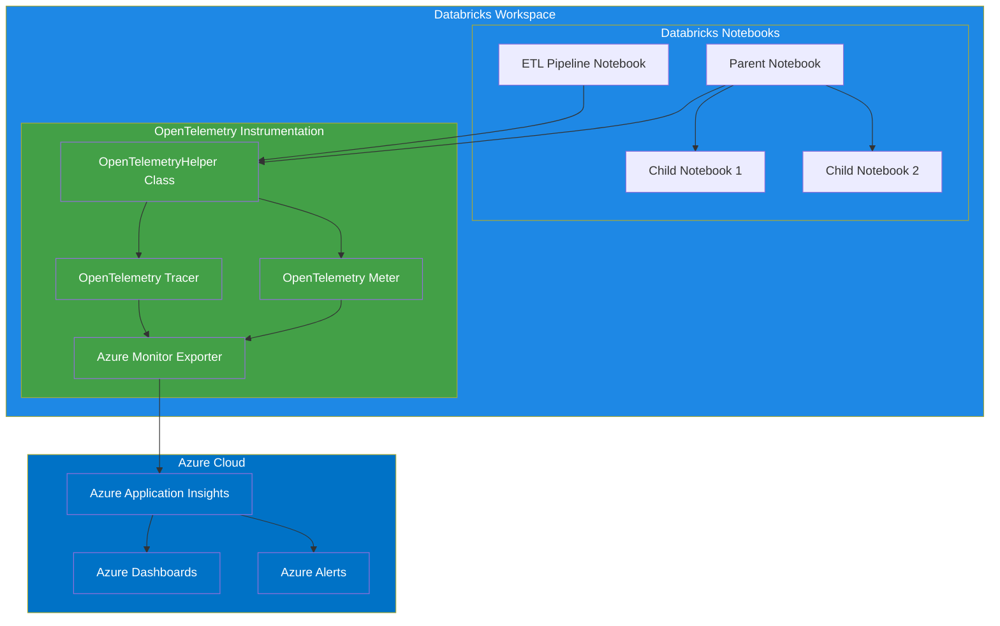

# OpenTelemetry Architecture Diagram

This diagram illustrates the architecture of the Databricks OpenTelemetry Azure Monitoring solution. It shows how:

1. Databricks notebooks (ETL Pipeline and Parent-Child workflows) use the OpenTelemetryHelper class
2. The OpenTelemetryHelper class manages the OpenTelemetry Tracer and Meter
3. Telemetry data is exported to Azure Application Insights via the Azure Monitor Exporter
4. Azure Application Insights provides dashboards and alerts for monitoring

The color coding helps distinguish between:
- Blue: Databricks components
- Green: OpenTelemetry components
- Azure Blue: Azure components
