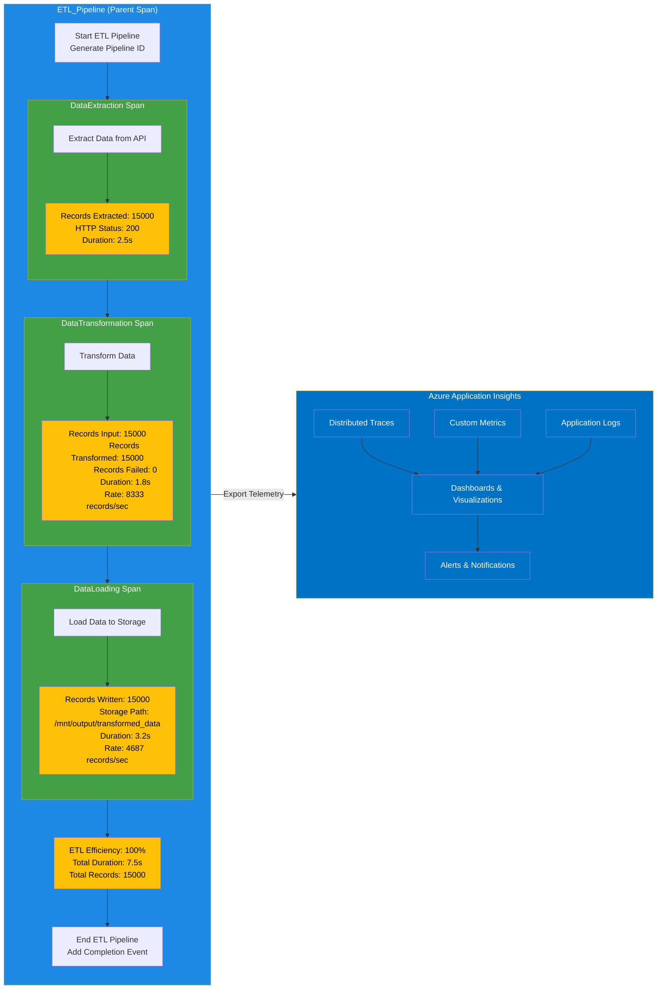

# ETL Pipeline with OpenTelemetry Visualization

This diagram visualizes the ETL pipeline with OpenTelemetry instrumentation. It shows:

1. The hierarchical structure of spans:
   - ETL_Pipeline (Parent Span)
     - DataExtraction (Child Span)
     - DataTransformation (Child Span)
     - DataLoading (Child Span)

2. The flow of data through the pipeline stages:
   - Extraction: Retrieving data from an API
   - Transformation: Processing and cleaning the data
   - Loading: Writing the transformed data to storage

3. Key metrics captured at each stage:
   - Record counts
   - Processing durations
   - Processing rates
   - Status codes and error information

4. The export of telemetry data to Azure Application Insights:
   - Traces for distributed tracing
   - Custom metrics for performance monitoring
   - Logs for error tracking
   - Dashboards and alerts for visualization and notification

The color coding helps distinguish between:
- Blue: Overall ETL pipeline
- Green: Individual pipeline stages
- Yellow: Metrics and performance data
- Azure Blue: Azure monitoring components
