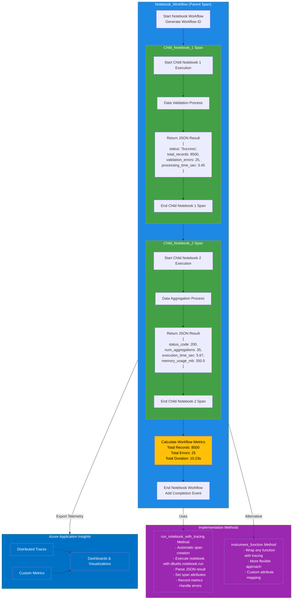

# Parent-Child Notebook Workflow with OpenTelemetry

This diagram illustrates the parent-child notebook workflow with OpenTelemetry instrumentation. It shows:

1. The hierarchical structure of spans:
   - Notebook_Workflow (Parent Span)
     - Child_Notebook_1 (Child Span)
     - Child_Notebook_2 (Child Span)

2. The execution flow of the notebook workflow:
   - Parent notebook starts and generates a workflow ID
   - Child Notebook 1 executes (data validation)
   - Child Notebook 2 executes (data aggregation)
   - Parent notebook calculates overall metrics
   - Parent notebook ends and adds completion event

3. The JSON results returned by child notebooks:
   - Child Notebook 1 returns validation results
   - Child Notebook 2 returns aggregation results

4. The implementation methods provided by OpenTelemetryHelper:
   - `run_notebook_with_tracing`: Simplified method for notebook execution with automatic tracing
   - `instrument_function`: More flexible method for wrapping any function with tracing

5. The export of telemetry data to Azure Application Insights:
   - Traces for distributed tracing
   - Custom metrics for performance monitoring
   - Dashboards for visualization

The color coding helps distinguish between:
- Blue: Overall notebook workflow
- Green: Child notebook executions
- Purple: Implementation methods
- Yellow: Metrics and performance data
- Azure Blue: Azure monitoring components
